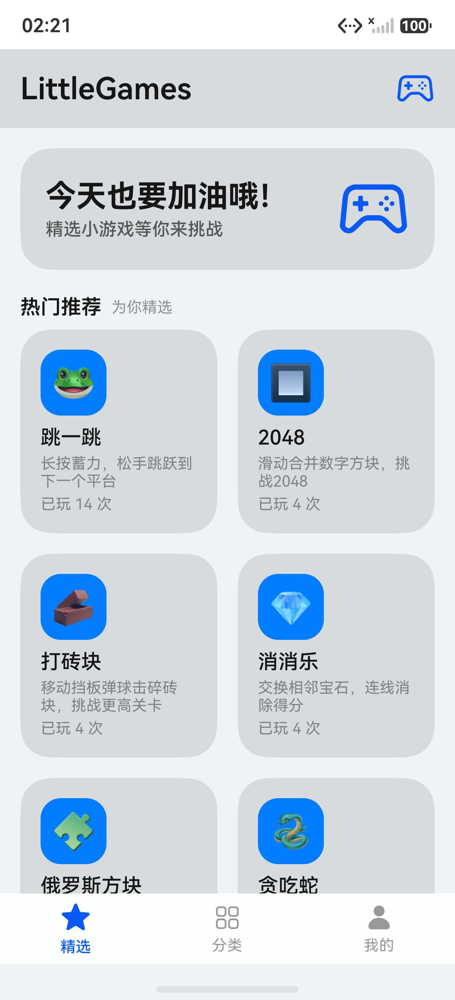
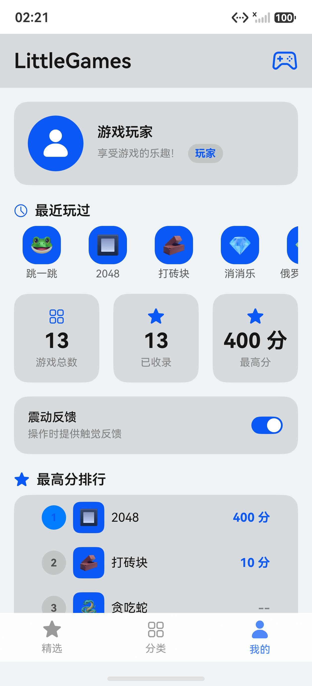
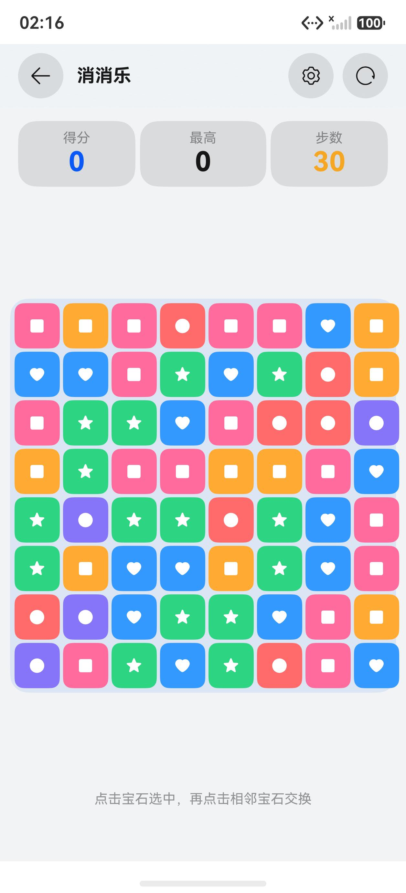

# 玩趣盒

### 13 款小游戏，随手开一局。

基于 HarmonyOS NEXT 的原生小游戏合集，采用蓝白简洁应用图标。打开即玩，战绩留在本机。

项目仓库名为 LittleGames，应用名称为「玩趣盒」。

**ArkTS / ArkUI** · **HarmonyOS 6.1.1（API 24）** · **手机 / 平板工程配置**

---

## 界面预览

  
  
  

精选推荐 · 个人战绩 · 沉浸游玩｜截图来自 API 24 本地模拟器

## 玩什么

| 经典休闲 · 7 款 | 玩法 |
| --- | --- |
| 🐍 贪吃蛇 | 控制方向，吃到食物并避开自己 |
| 🧩 俄罗斯方块 | 旋转、移动方块，消除整行 |
| 🔲 2048 | 滑动合并数字，向 2048 前进 |
| 🐹 打地鼠 | 在限定时间内点击冒出的地鼠 |
| 💣 扫雷 | 翻开安全格，标记地雷 |
| 🐸 跳一跳 | 长按蓄力，松手跃向下一平台 |
| 🧱 打砖块 | 移动挡板，反弹小球击碎砖块 |

| 益智解谜 · 6 款 | 玩法 |
| --- | --- |
| 🔢 数独 | 根据已知数字填满九宫格 |
| 🧩 滑动拼图 | 移动方块，还原正确顺序 |
| 💠 华容道 | 移动棋子，为曹操打开出口 |
| 🎲 猜数字 | 根据 A/B 提示推理四位数字 |
| 🃏 记忆翻牌 | 翻开卡片，找出相同配对 |
| 💎 消消乐 | 交换相邻宝石，连线消除得分 |

## 体验细节

- **找游戏更快**：精选页按游玩次数推荐；分类页支持分类筛选，以及按名称或描述实时搜索。
- **战绩自动保存**：最高分、游玩次数、最近玩过顺序和触感反馈开关通过 Preferences 保存在本机；“我的”区分游戏总数与已玩游戏数。
- **界面随主题变化**：页面使用 HarmonyOS 系统色与统一间距，适配浅色和深色模式；可点击控件提供按压反馈。
- **对局操作一致**：游戏页复用标题栏、方向控制、结算与退出确认组件。部分游戏提供简单、普通、困难难度。
- **语言与设备**：提供简体中文、英文字符串资源；工程声明支持 phone 和 tablet。
- **游戏区适配**：主要棋盘根据页面可用宽高调整尺寸；结算内容使用实体卡片，提高可读性。

## 运行项目

### 在 DevEco Studio 中

1. 安装支持 **HarmonyOS 6.1.1（API 24）** 的 DevEco Studio 和 SDK。
2. 打开本仓库根目录，等待工程同步完成。
3. 启动 Local Emulator，或连接 HarmonyOS NEXT 真机。
4. 选择设备，点击 **Run**。真机运行前需在 DevEco Studio 中配置签名。

### 命令行构建（Windows PowerShell）

本项目使用 DevEco Studio 自带的 hvigor，仓库根目录没有 hvigorw。以下命令按默认安装路径编写；如安装在其他位置，请修改第一行。

~~~powershell
$studio = 'C:\Program Files\Huawei\DevEco Studio'
$env:DEVECO_SDK_HOME = "$studio\sdk"
$env:JAVA_HOME = "$studio\jbr"
$env:PATH = "$studio\tools\node;$studio\tools\ohpm\bin;$studio\jbr\bin;$env:PATH"
& "$studio\tools\node\node.exe" "$studio\tools\hvigor\bin\hvigorw.js" assembleHap --mode module -p product=default --no-daemon
~~~

构建产物位于 **entry/build/default/outputs/default/**。当前仓库未配置签名，命令行构建生成 unsigned HAP；真机安装请先配置签名。

## 工程结构

~~~text
AppScope/                     应用信息与图标
entry/src/main/
├── ets/
│   ├── common/               设计令牌、游戏常量、通用工具
│   ├── components/           游戏页共用组件
│   ├── model/                游戏列表与本地数据
│   ├── pages/
│   │   ├── home/             精选、分类、我的
│   │   ├── classic/          7 款经典休闲游戏
│   │   └── puzzle/           6 款益智解谜游戏
│   └── router/               页面路由
└── resources/                浅色、深色及多语言资源
docs/screenshots/             本地模拟器界面截图
~~~

主模块采用 **@ComponentV2**、**@Local**、**Navigation / NavPathStack** 和 **GridRow**；运行时没有第三方依赖。模块仅声明振动权限，不需要网络权限。

## 验证情况

已在 **HarmonyOS 6.1.1 / API 24 手机和 Mate X7 展开态本地模拟器**完成构建与安装。手机逐一检查了 13 款游戏的入口和首屏；近期修复回归覆盖俄罗斯方块与 2048 布局、结算卡片、最近玩过顺序、设置重启持久化，以及跳一跳后台恢复抽查。

运行中的分屏、旋转与折叠切换、真机、平板、无障碍和性能专项仍需验证。此次回归未覆盖暗色模式全流程，也未完成所有游戏的通关/失败路径；新增单元测试尚未执行。详细结果见[模拟器实测与修复回归记录](docs/emulator-review-2026-09-25.md)。

2026-09-26 将应用名称统一为「玩趣盒」，桌面、启动窗口及 README 使用新的蓝白图标。历史界面截图可能保留旧名称，图标与生成提示词见[品牌设计记录](docs/branding/app-icon-concept-v2.md)。

---

**挑一款，开始玩吧。**

