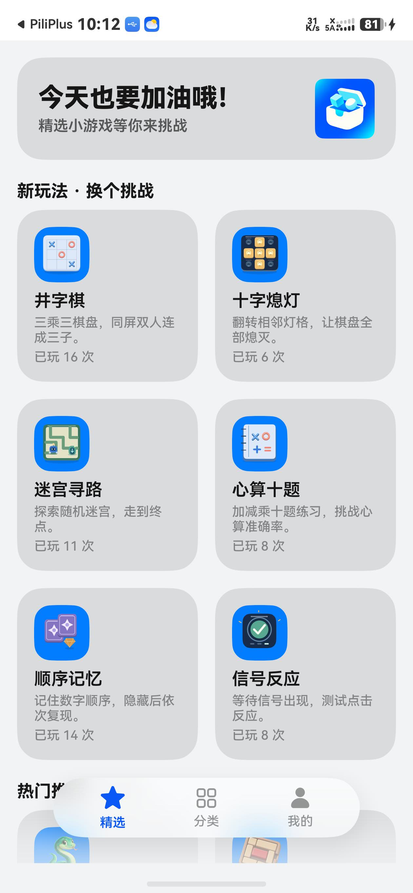
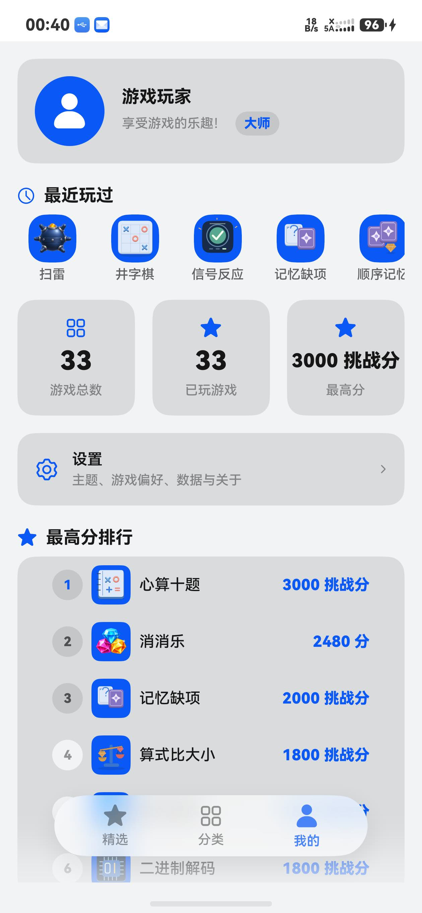
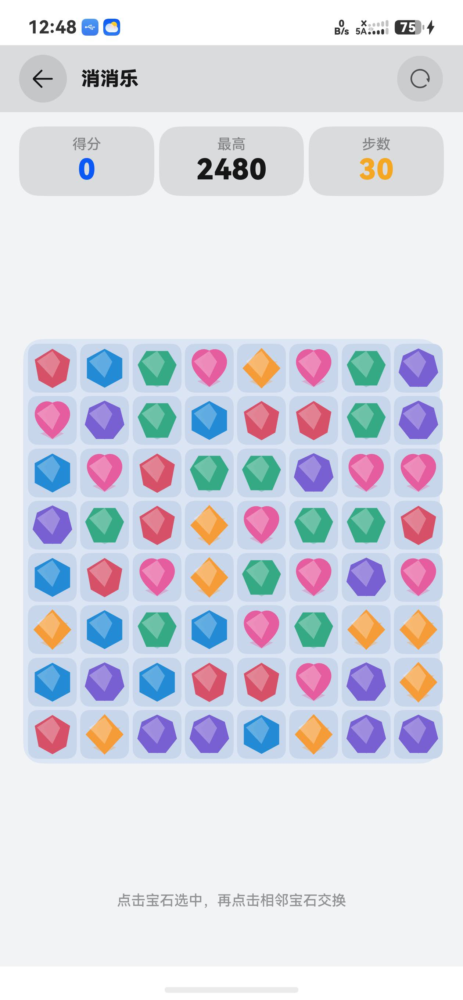

# 玩趣盒

### 六大分类，33 款小游戏，随手开一局。

基于 HarmonyOS NEXT 的原生小游戏合集，采用蓝青色游戏盒子图标。打开即玩，战绩留在本机。

项目仓库名为 LittleGames，应用名称为「玩趣盒」。

**ArkTS / ArkUI** · **HarmonyOS 6.1.1（API 24）** · **手机 / 平板工程配置**

---

## 界面预览

  
  
  

精选推荐 · 个人战绩 · 沉浸游玩｜2026-10-02 Mate 60 Pro 真机实拍

## 玩什么

| 分类 | 数量 | 游戏 |
| --- | ---: | --- |
| 街机休闲 | 3 | 贪吃蛇、俄罗斯方块、打砖块 |
| 逻辑解谜 | 10 | 扫雷、滑动拼图、华容道、消消乐、十字熄灯、色块归一、迷宫寻路、汉诺塔、跳子独留、数字绘格 |
| 棋盘对弈 | 5 | 井字棋、五子棋、翻转棋、落子四连、取石子 |
| 数字训练 | 8 | 2048、数独、猜数字、心算十题、算式比大小、数列推演、二进制解码、补数求和 |
| 记忆专注 | 4 | 记忆翻牌、数字寻序、顺序记忆、记忆缺项 |
| 反应节奏 | 3 | 打地鼠、跳一跳、信号反应 |

棋盘对弈为同屏双人玩法。新增 20 款使用独立规则代码、程序生成谜题及自行绘制的几何图标。具体玩法、素材来源和验证范围见[扩充记录](docs/game-expansion-2026-09-27.md)。

## 体验细节

- **找游戏更快**：精选页按游玩次数推荐；分类页支持分类筛选，以及按名称或描述实时搜索。
- **战绩自动保存**：最高分、游玩次数、最近玩过顺序和用户设置通过 Preferences 保存在本机；“我的”区分游戏总数与已玩游戏数。
- **二级设置菜单**：从“我的 → 设置”调整跟随系统 / 浅色 / 深色主题、震动反馈、默认难度、各游戏难度记忆和退出对局确认。偏好重启后保留；默认难度在下次进入支持难度的游戏时生效。
- **数据与关于**：恢复默认设置保留战绩；清空游玩数据保留偏好，两项操作都需要确认。关于页面提供软件声明、本地数据与权限说明、使用帮助，版本号读取当前安装包。
- **界面随主题变化**：页面使用 HarmonyOS 系统色与统一间距，适配浅色和深色模式；可点击控件提供按压反馈。
- **对局操作一致**：游戏页复用标题栏、方向控制、结算与退出确认组件。部分游戏提供简单、普通、困难难度。
- **语言与设备**：提供简体中文、英文字符串资源；工程声明支持 phone 和 tablet。
- **游戏区适配**：主要棋盘根据页面可用宽高调整尺寸；结算内容使用实体卡片，提高可读性。

## 运行项目

### 在 DevEco Studio 中

1. 安装支持 **HarmonyOS 6.1.1（API 24）** 的 DevEco Studio 和 SDK。
2. 打开本仓库根目录，等待工程同步完成。
3. 启动 Local Emulator，或连接 HarmonyOS NEXT 真机。
4. 选择设备，点击 **Run**。真机运行前需在 DevEco Studio 中配置签名。

### 命令行构建（Windows PowerShell）

本项目使用 DevEco Studio 自带的 hvigor，仓库根目录没有 hvigorw。以下命令按默认安装路径编写；如安装在其他位置，请修改第一行。

~~~powershell
$studio = 'C:\Program Files\Huawei\DevEco Studio'
$env:DEVECO_SDK_HOME = "$studio\sdk"
$env:JAVA_HOME = "$studio\jbr"
$env:PATH = "$studio\tools\node;$studio\tools\ohpm\bin;$studio\jbr\bin;$env:PATH"
& "$studio\tools\node\node.exe" "$studio\tools\hvigor\bin\hvigorw.js" assembleHap --mode module -p product=default --no-daemon
~~~

构建产物位于 **entry/build/default/outputs/default/**。仓库共享配置不包含个人签名材料，默认生成 unsigned HAP；在 DevEco Studio 中配置本机调试签名后可生成 signed HAP 并安装到真机。验收使用的签名配置仅保存在测试电脑，不提交证书、私钥或口令。

### 桌面逻辑回归

在项目根目录依次运行：

~~~powershell
node scripts/test-performance.cjs
node scripts/test-collection.cjs
node scripts/test-continuation.cjs
node scripts/test-klotski-ui-state.cjs
node scripts/test-generation-logic.cjs
node scripts/test-window-sizing.cjs
~~~

运行器默认使用 DevEco Studio 自带的 TypeScript 模块；其他安装路径可通过 `ARKTS_TYPESCRIPT_PATH` 指定。测试直接运行转换后的 Model / ViewModel，替代原生服务与时钟；ArkTS 编译、设备渲染和性能需分别验证。

## 工程结构

~~~text
AppScope/                     应用信息与图标
entry/src/main/
├── ets/
│   ├── common/               设计令牌、游戏常量、通用工具
│   ├── components/           游戏页共用组件
│   ├── model/                游戏列表与本地数据
│   ├── pages/
│   │   ├── home/             精选、分类、我的
│   │   ├── classic/          原有街机与休闲页面
│   │   ├── puzzle/           原有益智游戏页面
│   │   ├── collection/       新增 20 款共用页面
│   │   └── settings/         设置与关于页面
│   └── router/               页面路由
└── resources/                浅色、深色及多语言资源
docs/screenshots/             模拟器与真机界面截图
docs/device-acceptance/       真机验收报告与原始证据
docs/logic-audit-2026-10-02/  生成逻辑与难度审计记录
scripts/                     回归、素材生成及设备验收工具
~~~

主模块采用 **@ComponentV2**、**@Local**、**Navigation / NavPathStack** 和 **GridRow**；运行时没有第三方依赖。模块仅声明振动权限，不需要网络权限。

## 验证情况

截至 **2026-10-02**，当前工作区的 DevEco / API 24 `assembleHap` 构建成功，**350/350 项桌面回归通过**：性能及设置 159 项、合集 82 项、接续 72 项、华容道界面状态 3 项、生成与难度 26 项、窗口尺寸 8 项。出题边界、可解性、难度切换和重开竞态的修复与采样规模见[逻辑审计报告](docs/logic-audit-2026-10-02/README.md)。

**Mate 60 Pro（ALN-AL00）真机已覆盖 33 款游戏、58 组选定用例**，包括多款解谜游戏完整通关、三档难度生成、实时游戏操作、暂停与后台恢复，以及迷宫切难度后的渲染修复。先前已完成 33 款浅色/深色入口与返回、设置持久化和结算弹窗复测；各轮对应不同测试包，以报告中的哈希和实际操作范围为准。详见[最新玩法验收](docs/device-acceptance/generation-audit-2026-10-02.md)与[设备验收索引](docs/device-acceptance/README.md)。

**WEB-W00 平板已完成横屏、竖屏各 33 款入口与返回检查**，并实测系统悬浮窗和不同高度的分屏。已修复打地鼠洞位越界、精选页在高窗口中居中，以及 8 款游戏在矮窗口中棋盘裁切或与操作区重叠的问题；复测范围、实际输入和各测试包身份见[平板窗口验收](docs/device-acceptance/tablet-window-2026-10-02/README.md)。

原有 13 款的 API 24 手机与 Mate X7 展开态模拟器结果保留在[历史回归记录](docs/emulator-review-2026-09-25.md)。**长局帧率、内存、温升耗电、英文与最大系统字体、无障碍、折叠切换、真实跨设备接续和 Release 包专项仍待验收**；现有记录不代表所有随机局、所有胜负路径或所有机型通过。

2026-10-02 更新为游戏盒子品牌图，桌面图标、系统启动窗口、首页和关于页已通过真机复测。当前启动窗口仅显示图标，不叠加应用内启动页；历史截图可能保留旧图标。素材来源与提示词见[品牌素材记录](docs/art/brand-game-box/README.md)，实测见[图标验收](docs/device-acceptance/brand-game-box-2026-10-02/README.md)。

---

**挑一款，开始玩吧。**

## 鸿蒙应用接续与沉浸光感

原有 13 款的对局接续与 HDS 原生悬浮页签材质保持 API 24；新增 20 款也已接入对局接续（信号反应恢复到准备状态）。实现说明、官方资料、验证结果与真机验收步骤见 [接续与沉浸光感说明](docs/harmonyos-continuation-immersive-light.md)。

接续的 72 项桌面回归已通过，真实系统跨设备接续及沉浸材质效果仍需专项验收。33 款版本的设备玩法检查已完成上述选定范围；最初扩充过程保留在[游戏扩充记录](docs/game-expansion-2026-09-27.md)。
