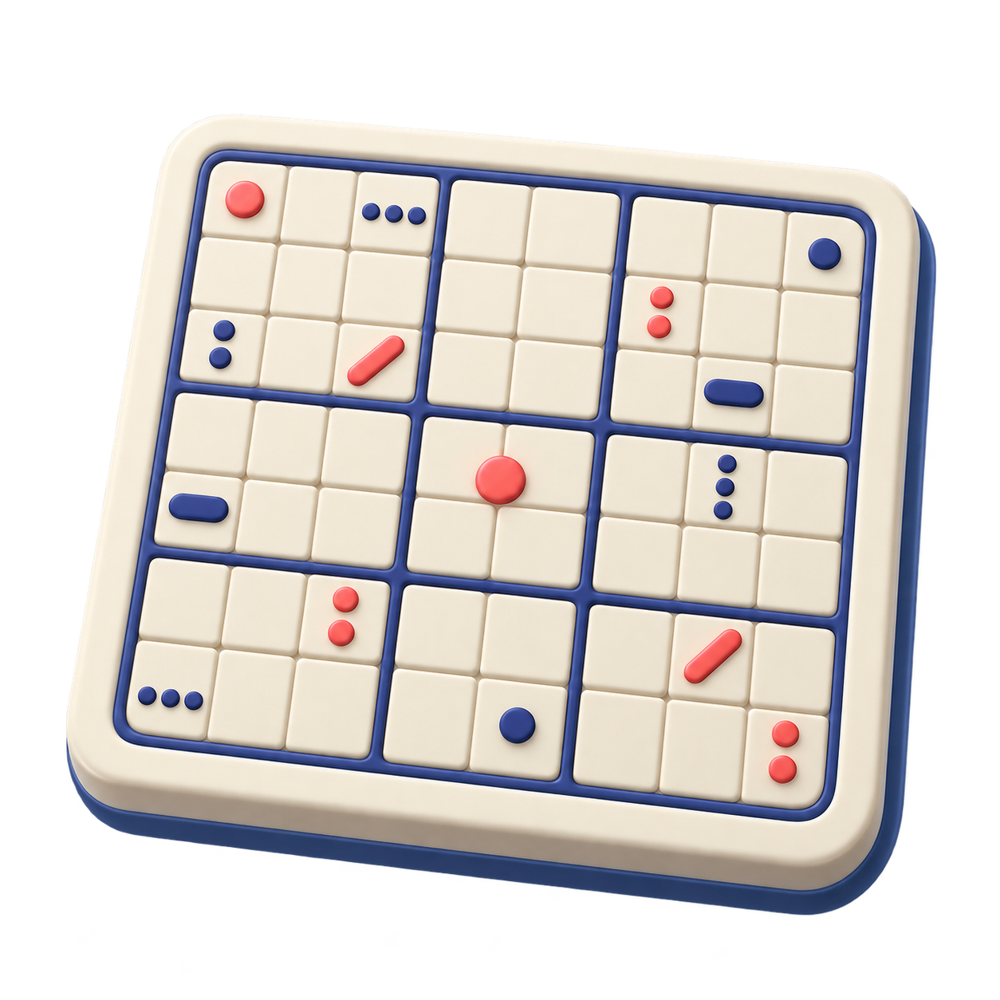
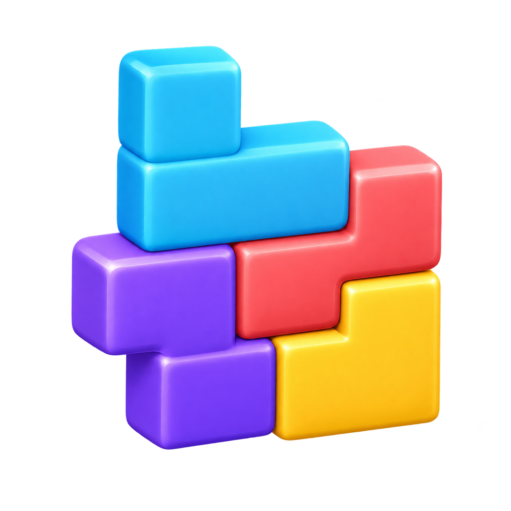
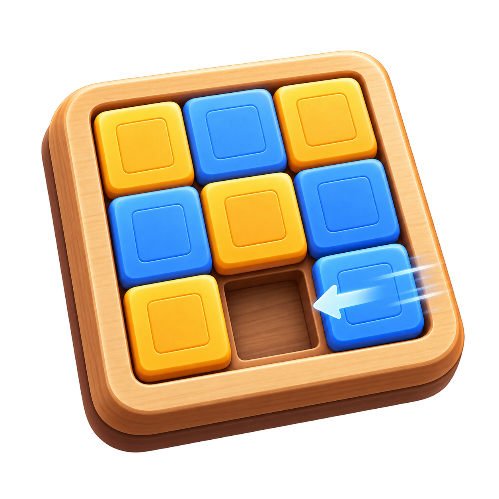
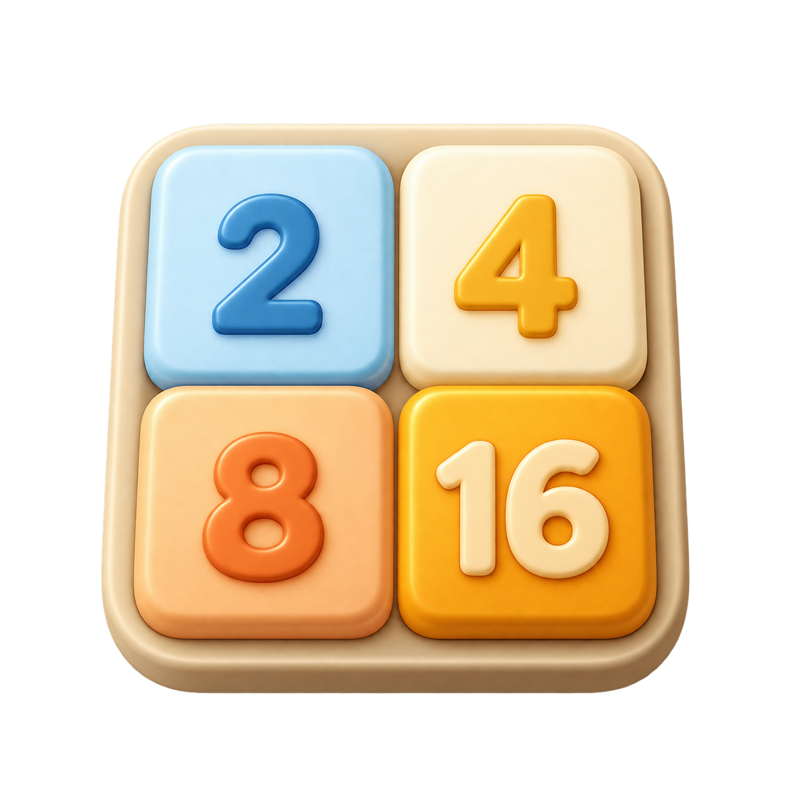
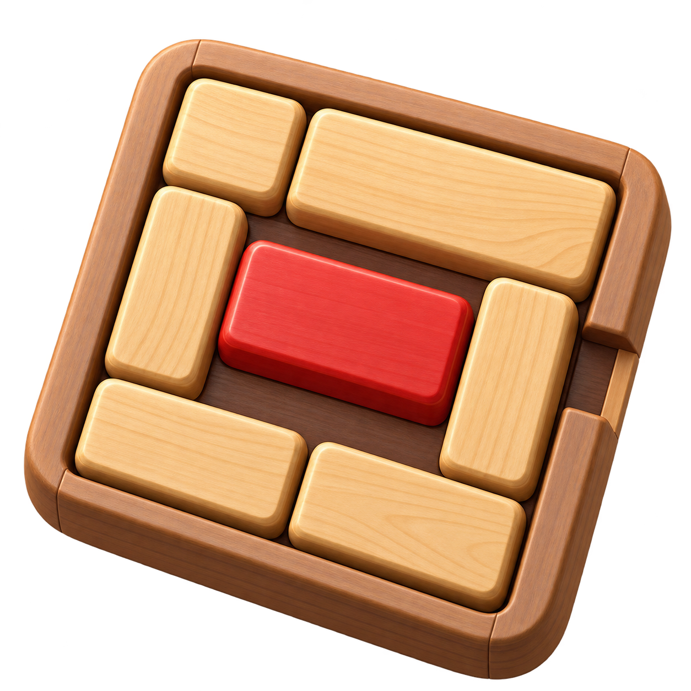
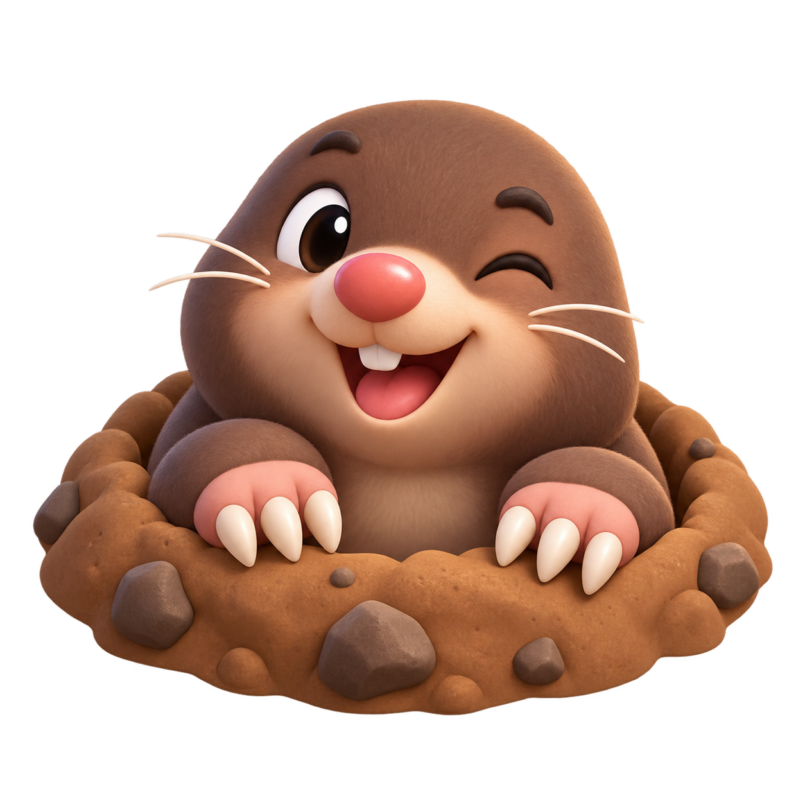
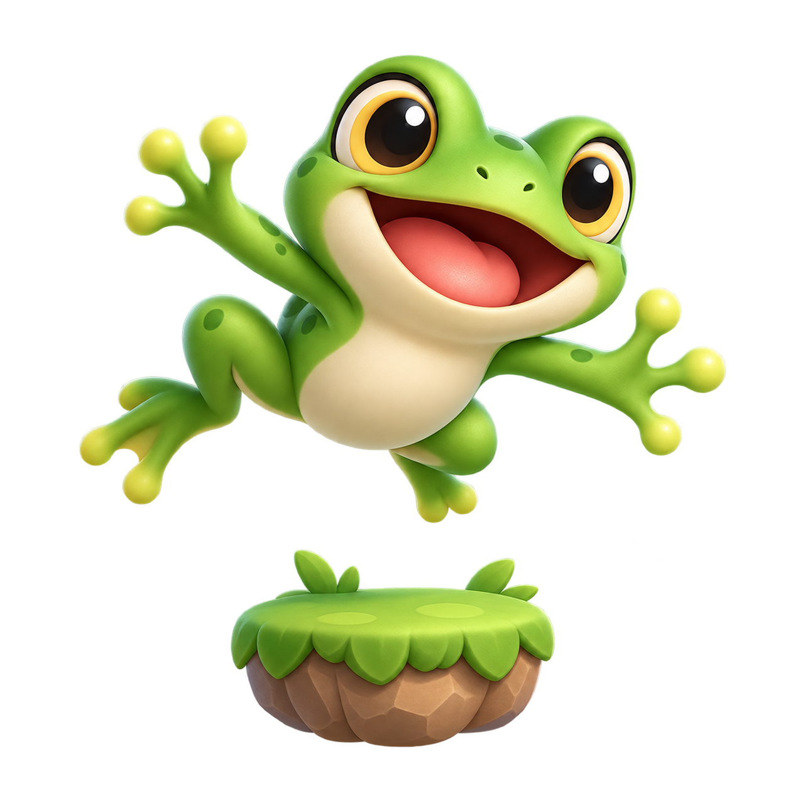
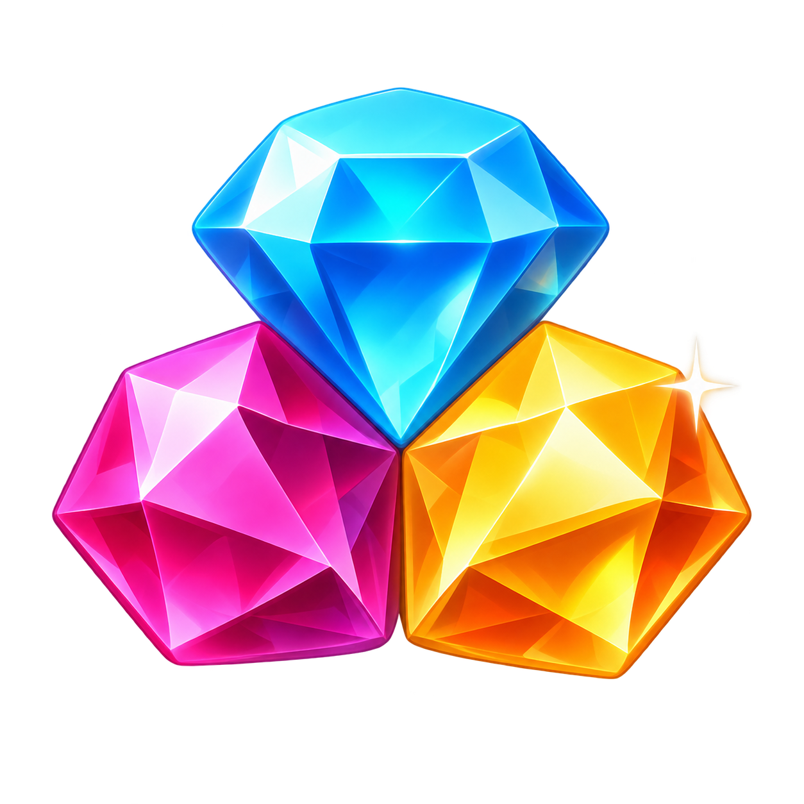

# LittleGames 游戏图标

本套图标使用内置 imagegen 工具生成，文件位于 `entry/src/main/resources/base/media/game_*.png`。所有图标均为透明背景 PNG，已替换游戏列表和“我的”页面中的 Emoji。

13 款游戏的对局素材及预览见 [对局美术](gameplay-art.md)。

## 预览

| 经典休闲 | 图标 | 益智解谜 | 图标 |
| --- | --- | --- | --- |
| 贪吃蛇 |  | 数独 |  |
| 俄罗斯方块 |  | 滑动拼图 |  |
| 2048 |  | 华容道 |  |
| 打地鼠 |  | 猜数字 |  |
| 扫雷 |  | 记忆翻牌 |  |
| 跳一跳 |  | 消消乐 |  |
| 打砖块 |  | | |

## 生成提示词

每张图标使用以下共同提示词，并追加对应题材描述：

> Use case: stylized-concept. Asset type: one square game catalog icon for a HarmonyOS casual-game collection. Style: cohesive premium 2.5D toy-like illustration, simplified geometry, smooth matte finish, soft studio highlights, bright but controlled colors, designed to remain legible at 44–52 vp on a blue UI tile. Composition: exactly one centered subject filling about 75 percent of the square with generous transparent padding. Background: genuinely transparent alpha, no colored square, no environment, no floor. Constraints: original artwork, no text, no watermark, no border, no extra objects, no emoji imitation.

题材描述依次为：绿色盘曲小蛇、彩色下落积木、带数字的 2048 方块棋盘、探出地洞的鼹鼠、深蓝色扫雷地雷、九宫格数独棋盘、留有空格的滑动拼图、木质华容道棋盘、问号线索代币、翻开的记忆卡牌、跃起的青蛙、击碎砖块的弹球与挡板、三颗彩色宝石。2048 图标最终版改用明确的 2、4、8、16 数字方块提示词生成。
