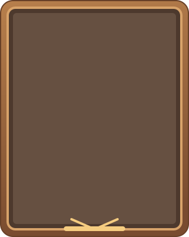
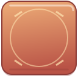
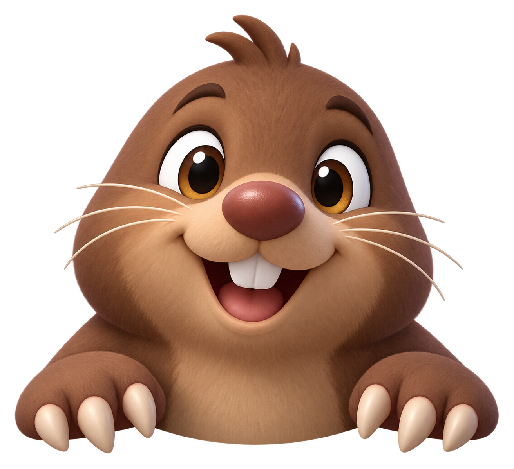
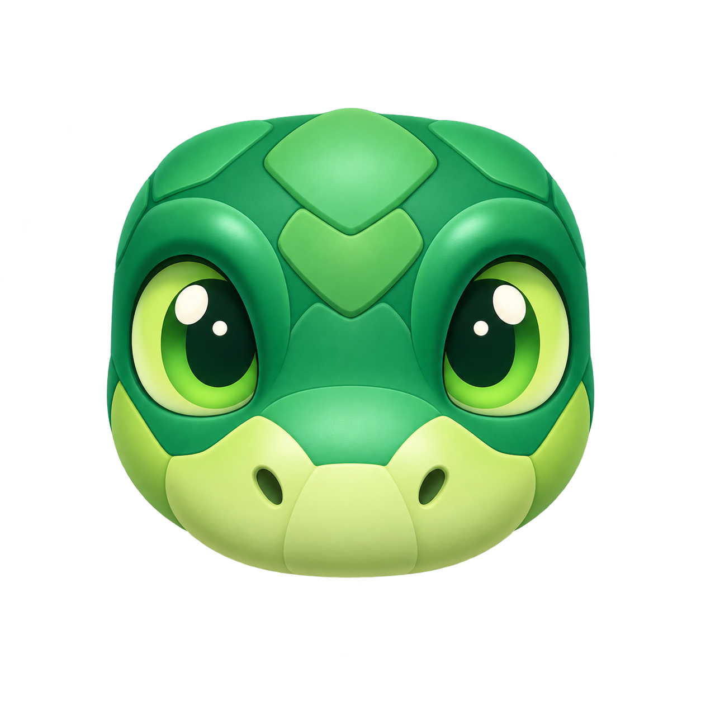
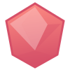

# 13 款游戏对局美术

对局素材位于 `entry/src/main/resources/base/media/play_*`，已接入 13 个游戏页面。SVG 为可缩放矢量资源，两个角色使用透明 PNG。运行 `node scripts/generate-gameplay-art.mjs` 可以重新生成 SVG 源文件。

| 游戏 | 对局素材 |
| --- | --- |
| 贪吃蛇 | 蛇头、食物 |
| 俄罗斯方块 | 方块高光 |
| 2048 | 数字方块表面 |
| 打地鼠 | 地洞、鼹鼠角色 |
| 扫雷 | 地雷、旗帜 |
| 数独 | 棋盘格装饰 |
| 滑动拼图 | 拼图块表面 |
| 华容道 | 木质棋盘、曹操、横将、竖将、小兵 |
| 猜数字 | 数字键表面 |
| 记忆翻牌 | 卡背、12 种原创配对图案 |
| 跳一跳 | 青蛙角色、平台 |
| 打砖块 | 砖块、挡板、弹球 |
| 消消乐 | 6 种宝石 |

## 华容道预览

   

## 其他素材预览

   

对局资源延续蓝色、珊瑚色与木质暖色的玩具式视觉。数字、计分与操作文字仍由 ArkUI 绘制，以保持清晰度和可访问性。
